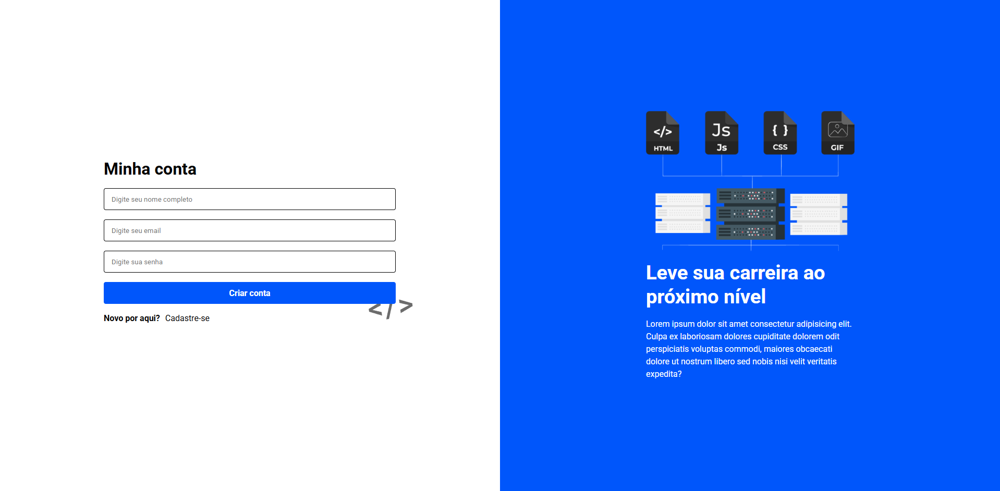
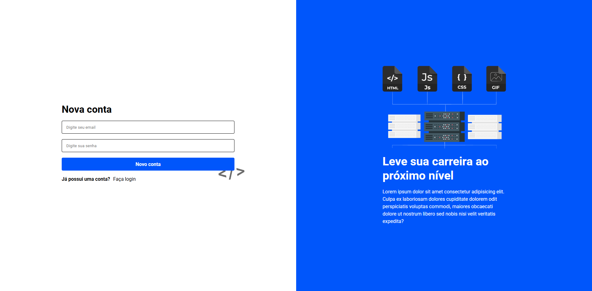

# Tela de Autenticação Interativa - Cadastro & Login

Uma interface moderna, responsiva e clean para sistemas de autenticação (Sign Up / Sign In), desenvolvida exclusivamente com **HTML5** e **CSS3**. O projeto conta com uma divisão elegante em duas colunas: um formulário minimalista à esquerda e uma seção institucional/visual engajadora à direita voltada para desenvolvedores.

---

## Demonstração

| Tela de Login (Minha Conta) | Tela de Registro (Nova Conta) |
| :---: | :---: |
|  |  |

---

## Funcionalidades

- **Alternância de Telas:** Interface adaptada e limpa para fluxos de criação de conta e login.
- **Formulários Otimizados:** Inputs bem espaçados com placeholders intuitivos e validação nativa.
- **Design de Duas Colunas:** Layout moderno inspirado nas melhores plataformas SaaS e portais de tecnologia.
- **Totalmente Responsivo:** Adaptável para dispositivos móveis, tablets e desktops através de boas práticas com Flexbox/Grid.
- **Identidade Visual Marcante:** Uso estratégico de contraste com um tom azul vibrante para guiar o foco do usuário nas ações principais (CTA).

---

## Tecnologias Utilizadas

O projeto foi construído puramente com tecnologias web fundamentais, sem a necessidade de frameworks ou bibliotecas pesadas:

- **HTML5:** Estruturação semântica dos formulários, inputs e blocos de conteúdo.
- **CSS3:** Estilização avançada, sistema de layout flexível, transições suaves nos botões, efeitos de hover e responsividade.
- **Google Fonts:** Tipografia moderna e de alta legibilidade integrada ao design.

---

## 📂 Estrutura do Projeto

```bash
├── assets/          # Imagens, ícones e capturas de tela do layout
├── style.css        # Toda a estilização, variáveis e media queries
├── index.html       # Estrutura principal das telas de Login / Cadastro
└── README.md        # Documentação do projeto